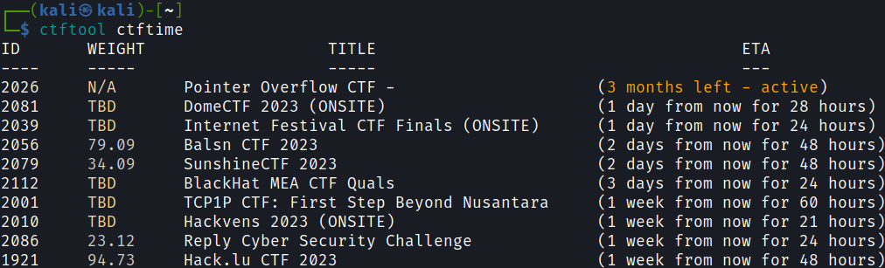

# CTFTOOL

[](https://pkg.go.dev/github.com/ritchies/ctftool)
[](https://goreportcard.com/report/github.com/ritchies/ctftool)
[](https://github.com/RitchieS/ctftool/actions/workflows/tests.yml)

CTFTool is a robust and user-friendly command-line interface tool developed for interacting with [ctftime.org](https://ctftime.org) and downloading challenges from [CTFd](https://ctfd.io).



## Overview

CTFTool streamlines your Capture The Flag (CTF) experience by offering a powerful, yet easy-to-use, command-line interface. Designed to work with platforms like [ctftime.org](https://ctftime.org) and [CTFd](https://ctfd.io), this tool enables you to:

- Fetch details of upcoming CTF competitions from ctftime.org
- Rank the top 10 teams from both ctftime.org and CTFd platforms
- Directly download challenges from CTFd into your local environment
- Automatically generate writeup templates for each challenge

## Installation

There are several ways to install, it is recommended to download the latest release or build it from source using `make install` or `make build`.

### Downloading the latest release (recommended)

Visit the [releases page](https://github.com/ritchies/ctftool/releases/latest) page and download the appropriate version for your operating system.


### From Source (recommended)

Ensure you are on a recent version of Go, and have git and make installed.

1. Clone the repository:
```bash
git clone https://github.com/ritchies/ctftool.git
```

2. Navigate into the project directory:
```bash
cd ctftool
```

3. Install using make:
```bash
make install
```

You can also use `make build`, this will create an executable in the `bin/` directory.

### From Source: Using go install

Ensure you are on a recent version of Go and then run the following command:

```bash
go install -v github.com/ritchies/ctftool@latest
```

## Commands

```plain
Available Commands:
  completion  Generate shell completion script
  ctfd        Query CTFd instance
  ctftime     Query CTFTime
  help        Help about any command
  version     Print the version number

Flags:
      --config string       Config file (default is .ctftool.yaml)
  -h, --help                help for ctftool
      --log-format string   Logger output format (text|json) (default "text")
  -v, --verbose             Verbose logging
  -V, --version             Print version information
```

## Usage Examples

Show the upcoming CTF's listed on ctftime:

```bash
ctftool ctftime
```

Download challenges from a specific CTFd instance:

```bash
ctftool ctfd download --username=<user> --password=<pass> --url=<url> --output=<output>
```

## Current Limitations

- Unable to correctly handle Cloudflare bot protection
- Unable to effectively manage captchas
- Unsupported CTF instances, such as rCTF

## Completion

```bash
# Bash
  $ source <(ctftool completion bash)

# Zsh
  $ ctftool completion zsh > "${fpath[1]}/_ctftool"

# Fish
  $ ctftool completion fish > ~/.config/fish/completions/ctftool.fish

# PowerShell
  PS> ctftool completion powershell > ctftool.ps1
```

## Contributions

CTFTool is a personal project that embraces the spirit of open-source collaboration. Your contributions can play an essential role in its enhancement and evolution. To understand how you can contribute, please refer to our [Guide for Contributors](https://github.com/ritchies/ctftool/blob/master/CONTRIBUTING.md).

## License

CTFTool is released under the MIT license. For more information, visit the [LICENSE](https://github.com/ritchies/ctftool/blob/master/LICENSE) page.
